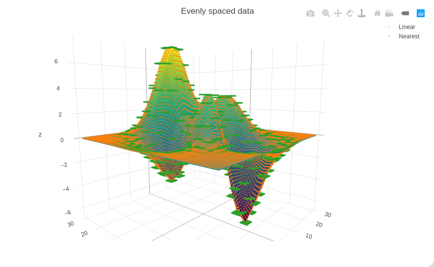

# Introduction
**gridInterp** is a header only c++ library that interpolates gridded formatted data.<br/> 
If your data are organized in rows, columns and layers then gridInterp can be used to interpolate between the data.


**IMPORTANT NOTE:**<br/>
The library is designed to be used up to 3D. 

# Install
There is really nothing to install. <br/>
All you need is to clone the [repository](https://github.com/giorgk/gridInterp)
```
git clone https://github.com/giorgk/gridInterp.git
```
To use the library just add the following include in your code and you are good to go.
```
#include "gridInterp.h"
```
Feel free to copy the entire gridInterp.h file under your source of the project. However there is a better way to embed the library into the code using cmake. <br/>
Before the `ADD_EXECUTABLE` command add the following line into your _CMakeLists.txt_ file
```
INCLUDE_DIRECTORIES(${GRID_INTERP})
```
Then during configuration pass the variable `GRID_INTERP` as
```
cmake -DGRID_INTERP=path/to/gridinterp
```
# How to use
All the methods and classes are defined into the `GRID_INTERP` namespace.
The main class is the `GRID_INTERP::interp`

One can defined 1-2-3D interpolation objects as follows:
```
GRID_INTERP::interp<1> oneD;
GRID_INTERP::interp<2> twoD;
GRID_INTERP::interp<3> threeD;
```
These are empty containers. You can populate the with data using the related methods.

In all dimensions the workflow is the same.

If the data are written into files then the method GRID_INTERP::interp::getDataFromFile can be used to populate the object with data.

To populate the data using code, first initialize the object
```
GRID_INTERP::interp<2> twoDinterp;
```
Then use either    
```
GRID_INTERP::interp<dim>::setAxis(int idim, double origin_in, double dx_in, int n)
```
for evenly spaced data or  
```  
GRID_INTERP::interp<dim>::setAxis(int idim, std::vector<double> &x_in)
```
for variably spaced data.    
Repeat the above code for each axis.

Next we can set data values using the method    
```
GRID_INTERP::interp<dim>::setValues(int l, int r, int c, double v_in)
```
Last we can set the interpolation method using    
```
GRID_INTERP::interp<dim>::setMethod(METHOD method_in)
```

The object is ready to be used for interpolation using the     
```
GRID_INTERP::interp<dim>::interpolate(double x, double y = 0, double z = 0)
```
method e.g:
```
twoDinterp.interpolate(30,5);
```
## Examples
Under the main folder of the repository there is a folder Rgridinterp with an R script
with examples on how to prepare the data using R. 
The script PrepateInputFiles.R creates the input files that are used in the tests.h file. 

This examples generate the following test figures:





# Interpolation types
The library offers 2 interpolation modes and 2 interpolation methods
## Interpolation methods
1. **Linear** interpolates linearly between the values. 
2. **Nearest** returns the value of the nearest coordinate.


## Layer interpolation (Not yet available)
This interpolation type is implemented for 3D only. 
In groundwater modelling it is common to have layers with varying elevation. 


# Documentation
Detail documentation can be found [here](https://codedocs.xyz/giorgk/gridInterp/)<br/>
[](https://codedocs.xyz/giorgk/gridInterp/)


## How to configure VSCODE for Simple C++
I hope the following link wont break soon.
https://code.visualstudio.com/docs/cpp/config-linux
